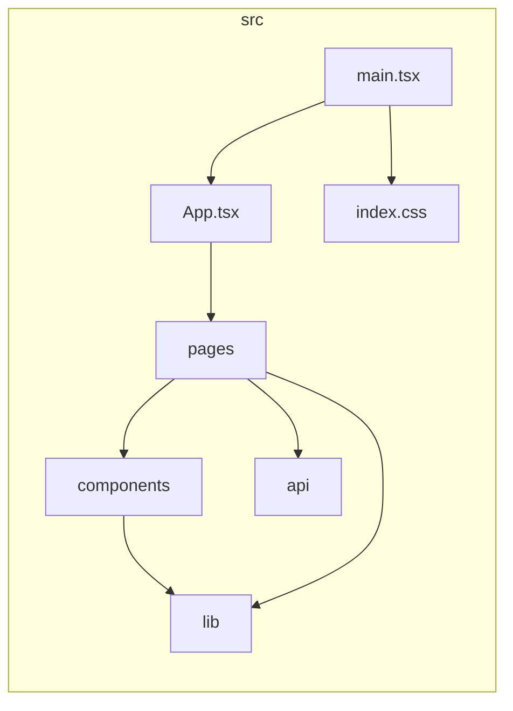

# 前端模組依賴圖

由 dependency-cruiser 從 `frontend/src` 的 import 產生，不要手動修改。重新產生：`scripts/gen-docs.sh frontend`

箭頭 A --> B 的意思是「A import 了 B」。

## 按資料夾

```mermaid
flowchart LR

subgraph src["src"]
  src_App_tsx["App.tsx"]
  src_api["api"]
  src_components["components"]
  src_index_css["index.css"]
  src_lib["lib"]
  src_main_tsx["main.tsx"]
  src_pages["pages"]
end
src_App_tsx-->src_pages
src_components-->src_lib
src_main_tsx-->src_App_tsx
src_main_tsx-->src_index_css
src_pages-->src_api
src_pages-->src_components
src_pages-->src_lib
```

## 按檔案

```mermaid
flowchart LR

subgraph src["src"]
  src_App_tsx["App.tsx"]
  subgraph src_pages["pages"]
    src_pages_Ask_tsx["Ask.tsx"]
    src_pages_Logs_tsx["Logs.tsx"]
    src_pages_Notifications_tsx["Notifications.tsx"]
    src_pages_Profile_tsx["Profile.tsx"]
    src_pages_ScholarshipDetail_tsx["ScholarshipDetail.tsx"]
    src_pages_ScholarshipList_tsx["ScholarshipList.tsx"]
    src_pages_Settings_tsx["Settings.tsx"]
  end
  subgraph src_api["api"]
    src_api_client_ts["client.ts"]
    src_api_schema_d_ts["schema.d.ts"]
  end
  subgraph src_components["components"]
    subgraph src_components_ui["ui"]
      src_components_ui_alert_tsx["alert.tsx"]
      src_components_ui_button_tsx["button.tsx"]
      src_components_ui_card_tsx["card.tsx"]
      src_components_ui_textarea_tsx["textarea.tsx"]
      src_components_ui_skeleton_tsx["skeleton.tsx"]
      src_components_ui_badge_tsx["badge.tsx"]
      src_components_ui_tabs_tsx["tabs.tsx"]
      src_components_ui_input_tsx["input.tsx"]
      src_components_ui_label_tsx["label.tsx"]
      src_components_ui_select_tsx["select.tsx"]
      src_components_ui_switch_tsx["switch.tsx"]
      src_components_ui_separator_tsx["separator.tsx"]
      src_components_ui_table_tsx["table.tsx"]
    end
    src_components_page_skeleton_tsx["page-skeleton.tsx"]
    src_components_country_picker_tsx["country-picker.tsx"]
    src_components_tag_input_tsx["tag-input.tsx"]
  end
  subgraph src_lib["lib"]
    src_lib_labels_ts["labels.ts"]
    src_lib_utils_ts["utils.ts"]
  end
  src_main_tsx["main.tsx"]
  src_index_css["index.css"]
end
src_App_tsx-->src_pages_Ask_tsx
src_App_tsx-->src_pages_Logs_tsx
src_App_tsx-->src_pages_Notifications_tsx
src_App_tsx-->src_pages_Profile_tsx
src_App_tsx-->src_pages_ScholarshipDetail_tsx
src_App_tsx-->src_pages_ScholarshipList_tsx
src_App_tsx-->src_pages_Settings_tsx
src_pages_Ask_tsx-->src_api_client_ts
src_pages_Ask_tsx-->src_components_ui_alert_tsx
src_pages_Ask_tsx-->src_components_ui_button_tsx
src_pages_Ask_tsx-->src_components_ui_card_tsx
src_pages_Ask_tsx-->src_components_ui_textarea_tsx
src_pages_Ask_tsx-->src_lib_labels_ts
src_api_client_ts-->src_api_schema_d_ts
src_pages_Logs_tsx-->src_api_client_ts
src_pages_Logs_tsx-->src_components_page_skeleton_tsx
src_pages_Logs_tsx-->src_components_ui_alert_tsx
src_pages_Logs_tsx-->src_components_ui_badge_tsx
src_pages_Logs_tsx-->src_components_ui_button_tsx
src_pages_Logs_tsx-->src_components_ui_card_tsx
src_pages_Logs_tsx-->src_components_ui_skeleton_tsx
src_pages_Logs_tsx-->src_lib_labels_ts
src_components_page_skeleton_tsx-->src_components_ui_skeleton_tsx
src_pages_Notifications_tsx-->src_api_client_ts
src_pages_Notifications_tsx-->src_components_page_skeleton_tsx
src_pages_Notifications_tsx-->src_components_ui_alert_tsx
src_pages_Notifications_tsx-->src_components_ui_badge_tsx
src_pages_Notifications_tsx-->src_components_ui_card_tsx
src_pages_Notifications_tsx-->src_components_ui_tabs_tsx
src_pages_Notifications_tsx-->src_lib_labels_ts
src_pages_Profile_tsx-->src_api_client_ts
src_pages_Profile_tsx-->src_components_country_picker_tsx
src_pages_Profile_tsx-->src_components_page_skeleton_tsx
src_pages_Profile_tsx-->src_components_tag_input_tsx
src_pages_Profile_tsx-->src_components_ui_alert_tsx
src_pages_Profile_tsx-->src_components_ui_button_tsx
src_pages_Profile_tsx-->src_components_ui_card_tsx
src_pages_Profile_tsx-->src_components_ui_input_tsx
src_pages_Profile_tsx-->src_components_ui_label_tsx
src_pages_Profile_tsx-->src_components_ui_select_tsx
src_pages_Profile_tsx-->src_lib_labels_ts
src_components_country_picker_tsx-->src_lib_utils_ts
src_components_tag_input_tsx-->src_lib_utils_ts
src_pages_ScholarshipDetail_tsx-->src_api_client_ts
src_pages_ScholarshipDetail_tsx-->src_components_page_skeleton_tsx
src_pages_ScholarshipDetail_tsx-->src_components_ui_alert_tsx
src_pages_ScholarshipDetail_tsx-->src_components_ui_badge_tsx
src_pages_ScholarshipDetail_tsx-->src_components_ui_button_tsx
src_pages_ScholarshipDetail_tsx-->src_components_ui_card_tsx
src_pages_ScholarshipDetail_tsx-->src_components_ui_tabs_tsx
src_pages_ScholarshipDetail_tsx-->src_lib_labels_ts
src_pages_ScholarshipDetail_tsx-->src_lib_utils_ts
src_pages_ScholarshipList_tsx-->src_api_client_ts
src_pages_ScholarshipList_tsx-->src_components_ui_alert_tsx
src_pages_ScholarshipList_tsx-->src_components_ui_badge_tsx
src_pages_ScholarshipList_tsx-->src_components_ui_button_tsx
src_pages_ScholarshipList_tsx-->src_components_ui_card_tsx
src_pages_ScholarshipList_tsx-->src_components_ui_input_tsx
src_pages_ScholarshipList_tsx-->src_components_ui_label_tsx
src_pages_ScholarshipList_tsx-->src_components_ui_select_tsx
src_pages_ScholarshipList_tsx-->src_components_ui_skeleton_tsx
src_pages_ScholarshipList_tsx-->src_components_ui_switch_tsx
src_pages_ScholarshipList_tsx-->src_lib_labels_ts
src_pages_ScholarshipList_tsx-->src_lib_utils_ts
src_pages_Settings_tsx-->src_api_client_ts
src_pages_Settings_tsx-->src_components_page_skeleton_tsx
src_pages_Settings_tsx-->src_components_ui_alert_tsx
src_pages_Settings_tsx-->src_components_ui_badge_tsx
src_pages_Settings_tsx-->src_components_ui_button_tsx
src_pages_Settings_tsx-->src_components_ui_card_tsx
src_pages_Settings_tsx-->src_components_ui_input_tsx
src_pages_Settings_tsx-->src_components_ui_label_tsx
src_pages_Settings_tsx-->src_components_ui_skeleton_tsx
src_pages_Settings_tsx-->src_components_ui_switch_tsx
src_pages_Settings_tsx-->src_lib_labels_ts
src_main_tsx-->src_App_tsx
src_main_tsx-->src_index_css
```
